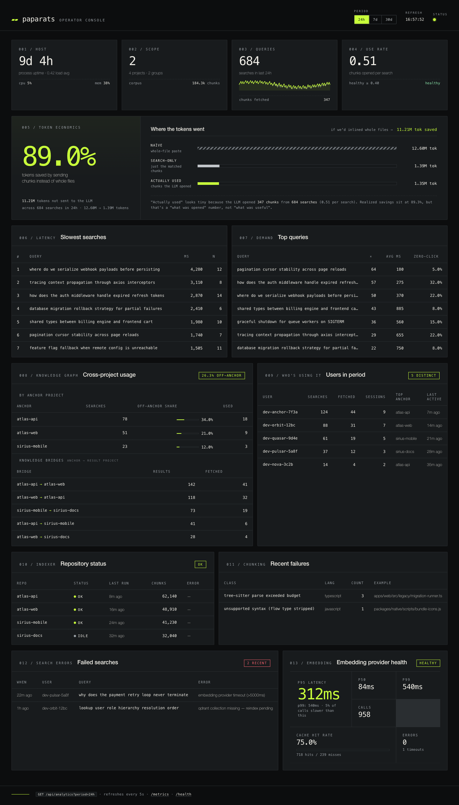

# Paparats MCP


[](https://www.npmjs.com/package/@paparats/cli)
[](LICENSE)
[](https://www.pulsemcp.com/servers/paparats-mcp)
[](https://lobehub.com/mcp/ibazylchuk-paparats-mcp)

[](https://codespaces.new/IBazylchuk/paparats-mcp) &nbsp;<sub>← try the full stack in your browser, no install ([details](#try-it-in-the-browser-no-install))</sub>

**Paparats-kvetka** — a magical flower from Slavic folklore that blooms on Kupala Night
and grants whoever finds it the power to see hidden things. Likewise, paparats-mcp
helps your agent see the right code across a sea of repositories.

> 🌿 Works with **Claude Code · Cursor · Windsurf · Copilot · Codex · Antigravity** · any MCP-compatible agent

**Give your AI coding assistant deep, real understanding of your entire workspace.**
Paparats indexes every repo you care about — semantically, with AST-aware chunking and
a cross-chunk symbol graph — and exposes it through the Model Context Protocol. Search
by meaning, follow `who-uses-what` through real symbol edges, see who last touched a
chunk and which ticket it came from — all without your code ever leaving your machine.

<a href="docs/dashboard.png"></a>

<sub>📊 The built-in `/ui` operator console — ROI, query quality, cross-project usage, per-user activity, indexer health. <em>Screenshot uses synthetic data (<code>?demo=1</code>) — no real queries, users, or project names.</em></sub>

- ⚡ **One install, one config.** `paparats install` → `paparats add ~/code/repo` → done.
- 🌳 **AST-aware chunking and symbol extraction.** Tree-sitter parses every supported
  file once and feeds both chunking and the cross-chunk symbol graph (calls /
  called_by / references / referenced_by) — 11 languages including TypeScript, Python,
  Go, Rust, Java, Ruby, C, C++, C#.
- 🧠 **Architectural memory that the agent maintains itself.** A second vector store
  per group holds **components, decisions (ADRs) and lessons learned** — your agent
  writes them as it works and reads them before answering. Server-side similarity gate
  prevents duplicates, supersedes links replace stale decisions, and every card carries
  an "updated N ago" stamp so the agent knows when memory is going stale.
- 💸 **Saves tokens.** Returns only the chunks that matter, with token-savings telemetry
  to prove it (per-query, per-user, per-anchor-project).
- 🔭 **Production-ready observability.** Prometheus `/metrics`, OpenTelemetry traces
  (Tempo, Jaeger, Honeycomb, Datadog, Grafana Cloud, **Elastic APM**), local SQLite
  analytics, and a built-in `/ui` operator console that visualises ROI, query quality,
  cross-project usage and indexer health in one screen.
- 🏠 **100% local by default.** Qdrant + Ollama on your machine. No cloud, no API keys,
  no telemetry leaving the box. Bring your own Qdrant Cloud / Ollama URL if you want.

---

## Table of Contents

- [Why Paparats?](#why-paparats)
- [Quick Start](#quick-start)
- [How the install works](#how-the-install-works)
- [Install variants](#install-variants)
- [Migrating from a v1 install](#migrating-from-a-v1-install)
- [Support agent setup](#support-agent-setup)
- [How It Works](#how-it-works)
- [Key Features](#key-features)
- [Use Cases](#use-cases)
- [Architectural memory](#architectural-memory-agent-maintained-adrs-components-lessons)
- [Configuration](#configuration)
- [MCP Tools Reference](#mcp-tools-reference)
- [Connecting MCP](#connecting-mcp)
- [CLI Commands](#cli-commands)
- [Monitoring](#monitoring)
- [Analytics & Observability](#analytics--observability)
- [Architecture](#architecture)
- [Embedding Model Setup](#embedding-model-setup)
- [Comparison with Alternatives](#comparison-with-alternatives)
- [Token Savings Metrics](#token-savings-metrics)
- [Contributing](#contributing)
- [Links](#links)

---

## Why Paparats?

AI coding assistants are smart, but they can only see files you open. They don't know your codebase structure, where the authentication logic lives, or how services connect. **Paparats fixes that.**

### What you get

- **Semantic code search** — ask "where is the rate limiting logic?" and get exact code ranked by meaning, not grep matches
- **Real-time sync** — edit a file, and 2 seconds later it's re-indexed. No manual re-runs
- **Cross-chunk symbol graph** — `find_usages` walks AST-derived edges (calls, called_by, references, referenced_by) so the agent can trace dependencies without re-grepping
- **Token savings** — return only relevant chunks instead of full files to reduce context size
- **Multi-project workspaces** — search across backend, frontend, infra repos in one query
- **100% local & private** — Qdrant vector database + Ollama embeddings. Nothing leaves your laptop
- **AST-aware chunking** — code split by AST nodes (functions/classes) via tree-sitter, not arbitrary character counts (TypeScript, JavaScript, TSX, Python, Go, Rust, Java, Ruby, C, C++, C#; regex fallback for Terraform)
- **Rich metadata** — each chunk knows its symbol name (from tree-sitter AST), service, domain context, and tags from directory structure
- **Git history per chunk** — see who last modified a chunk, when, and which tickets (Jira, GitHub) are linked to it
- **Architectural memory** — a living knowledge base of components, decisions (ADRs) and lessons learned, written by the agent as it learns, deduplicated server-side by vector similarity, and consulted on every support query so the agent stays consistent across sessions

### Who benefits

| Use Case                    | How Paparats Helps                                                                                     |
| --------------------------- | ------------------------------------------------------------------------------------------------------ |
| **Solo developers**         | Quickly navigate unfamiliar codebases, find examples of patterns, reduce context-switching             |
| **Multi-repo teams**        | Cross-project search (backend + frontend + infra), consistent patterns, faster onboarding              |
| **AI agents**               | Foundation for product support bots, QA automation, dev assistants — any agent that needs code context |
| **Legacy modernization**    | Find all usages of deprecated APIs, identify migration patterns, discover hidden dependencies          |
| **Contractors/consultants** | Accelerate ramp-up on client codebases, reduce "where is X?" questions                                 |

---

## Quick Start

### Try it in the browser (no install)

[](https://codespaces.new/IBazylchuk/paparats-mcp)

Spin up a full Qdrant + Ollama + paparats stack in a Codespace.
A small slice of the repo (`packages/shared/src`) is auto-indexed on first start so
you can run

```bash
paparats search -g demo 'gitignore filter'
```

within a few minutes. Codespace forwards port 9876 for MCP — point Cursor/Claude Code
at it via the URL VS Code shows in the Ports panel.

> Note: Codespaces is for demo only. With Ollama-on-CPU embedding the full repo
> would take 15+ minutes and can hit batch timeouts on large files. For real
> workloads run locally — or set `OPENAI_API_KEY` (or `VOYAGE_API_KEY`) as a
> Codespaces user secret and indexing drops to a couple of seconds; see the
> Embedding providers section below.

### Run locally

You need **Docker** and **Docker Compose v2**. On macOS, also install **Ollama natively** —
running it inside Docker on macOS is significantly slower because the Docker VM cannot
use Apple Silicon GPU acceleration.

```bash
# 1. Install the CLI.
npm install -g @paparats/cli

# 2. macOS only — install Ollama natively (Linux uses Docker Ollama by default).
brew install ollama

# 3. One-time bootstrap. Generates ~/.paparats/{docker-compose.yml,projects.yml},
#    starts the stack, downloads the embedding model, wires Cursor/Claude Code MCP.
paparats install

# 4. Add the projects you want indexed. Local paths bind-mount read-only into the
#    indexer; git URLs and owner/repo shorthand get cloned.
paparats add ~/code/my-project
paparats add git@github.com:acme/billing.git
paparats add acme/widgets

# 5. Watch it work.
paparats list
```

That's it. Your IDE is already wired (`~/.cursor/mcp.json`, `~/.claude/mcp.json`) to
`http://localhost:9876/mcp`. Open Cursor or Claude Code and ask:

> "Search this workspace for the auth middleware and show me everything that calls it."

### Existing v1 user?

Just run `paparats install` again. The installer detects the legacy per-project
compose, asks once before swapping it for the new global setup, and **preserves your
indexed data** (Qdrant collections, SQLite metadata, embedding cache). Your in-repo
`.paparats.yml` files keep working as per-project overrides.

---

## How the install works

`paparats install` is the only setup command. It creates a single global home at
`~/.paparats/`, brings up a Docker stack, and wires your MCP clients. Re-run it any time
to reconfigure — it diffs the existing compose and asks before overwriting hand edits.

```
~/.paparats/
├── docker-compose.yml          generated; hand-editable; install asks before overwriting
├── projects.yml        project list (CLI rewrites it; comments survive your manual edits)
├── install.json                install flags persisted so add/remove can regenerate compose
├── .env                        secrets — Qdrant API key, GitHub token; chmod 600
├── models/                     jina-code-embeddings GGUF + Modelfile
└── data/                       Docker volumes (mounted by name from compose)
    ├── qdrant/                 vector index
    ├── sqlite/                 metadata.db, embeddings.db, analytics.db
    └── repos/                  cloned remote projects
```

Inside the Docker stack:

| Service            | Image                          | Port  | Role                                                     |
| ------------------ | ------------------------------ | ----- | -------------------------------------------------------- |
| `paparats-mcp`     | `ibaz/paparats-server:latest`  | 9876  | MCP HTTP/SSE endpoints, search, metadata API             |
| `paparats-indexer` | `ibaz/paparats-indexer:latest` | 9877  | Cron + on-demand indexing, hot-reload of project list    |
| `qdrant`           | `qdrant/qdrant:latest`         | 6333  | Vector DB (skipped when you pass `--qdrant-url`)         |
| `ollama`           | `ibaz/paparats-ollama:latest`  | 11434 | Embedding model (Linux default; macOS uses native Ollama) |

The indexer hot-reloads `projects.yml`. Edits that **change project metadata
only** (group, language, indexing tweaks) reindex in place. Edits that **add or remove
local-path projects** require a stack restart so Docker picks up the new bind-mount —
the CLI does this for you on `paparats add` and `paparats remove`.

---

## Install variants

### Default (recommended)

```bash
paparats install
```

On macOS prefers native Ollama and dockerized Qdrant. On Linux defaults to Docker for
both.

### Bring your own Qdrant

```bash
paparats install --qdrant-url https://qdrant.example.com
# Asks for an API key after; stored in ~/.paparats/.env as QDRANT_API_KEY.
```

When `--qdrant-url` is set the Qdrant container is omitted from the stack entirely.

### Bring your own Ollama

```bash
paparats install --ollama-url http://10.0.0.5:11434
```

Skips both native and Docker Ollama.

> **You must register the embedding model on the remote Ollama yourself.** The installer
> will not touch a remote instance. On the Ollama host, download the GGUF
> ([jinaai/jina-code-embeddings-1.5b-Q8_0.gguf](https://huggingface.co/jinaai/jina-code-embeddings-1.5b-GGUF))
> and run:
>
> ```bash
> echo "FROM /path/to/jina-code-embeddings-1.5b-Q8_0.gguf" > Modelfile
> ollama create jina-code-embeddings -f Modelfile
> ```
>
> Then `paparats install --ollama-url http://that-host:11434` and Paparats will use it.

### Force Docker Ollama on macOS

```bash
paparats install --ollama-mode docker
```

Slower on Apple Silicon (no Metal GPU), but useful for parity testing or laptops without
brew.

### Scripted / CI

```bash
paparats install --non-interactive --force
```

Fails on any prompt; `--force` answers Y to compose-overwrite and migration prompts.

---

## Migrating from a v1 install

When `paparats install` finds a legacy `~/.paparats/docker-compose.yml` (the one from the
old per-project flow with no `paparats-indexer` service), it prints a one-screen
migration notice and asks before tearing the legacy stack down.

**What survives:** Qdrant collections, SQLite metadata, indexer repos, and any
`.paparats.yml` files inside your repos (those still take precedence over
`projects.yml` overrides).

**What's deleted:** the legacy `docker-compose.yml` and `.env`. They are regenerated on
the spot under the new schema.

**No re-indexing needed** — the data volumes are referenced by the same names in the new
compose. Add your projects with `paparats add` and they re-appear in `paparats list` with
their existing chunks.

If your install predates the `paparats-indexer.yml` → `projects.yml` rename, the
installer migrates the file in place on first run and prints a one-line notice.
The indexer also reads the legacy name as a fallback, so nothing breaks if you
roll out the indexer before re-running `paparats install`.

Pass `--force` to skip the migration prompt in scripts.

---

## Support agent setup

For bots and support teams that consume an existing Paparats server — no Docker, no
Ollama needed on this side.

```bash
# Connect to a running server (default: localhost:9876)
paparats install --mode support

# Connect to a remote server
paparats install --mode support --server http://prod-server:9876
```

The installer verifies the server is reachable, then wires Cursor MCP
(`~/.cursor/mcp.json`) and Claude Code MCP (`~/.claude/mcp.json`) to the support
endpoint. Tools available on `/support/mcp`: `search_code`, `get_chunk`, `find_usages`,
`list_projects`, `health_check`, `get_chunk_meta`, `search_changes`, `explain_feature`,
`recent_changes`, `impact_analysis`, **`arch_context`**, **`arch_record_component`**,
**`arch_record_decision`**, **`arch_record_lesson`** (architectural memory — see
[Key Features](#architectural-memory-agent-maintained-adrs-components-lessons)), plus
the analytics tools described in **Observability** below.

---

## How It Works

```
Your projects                   Paparats                       AI assistant
                                                               (Claude Code / Cursor)
  backend/                 ┌──────────────────────┐
    .paparats.yml ────────►│  Indexer              │
  frontend/                │   - chunks code       │          ┌──────────────┐
    .paparats.yml ────────►│   - embeds via Ollama │─────────►│ MCP search   │
  infra/                   │   - stores in Qdrant  │          │ tool call    │
    .paparats.yml ────────►│   - watches changes   │          └──────────────┘
                           └──────────────────────┘
```

### Indexing Pipeline

During each indexer cycle (cron-driven, on-demand via `paparats add`, or triggered by
the indexer's chokidar file watcher), every file in scope flows through this pipeline:

```
 Source file
     │
     ▼
 ┌─────────────────┐
 │ 1. File discovery│  Collect files from indexing.paths, apply
 │    & filtering   │  gitignore + exclude patterns, skip binary
 └────────┬────────┘
          ▼
 ┌─────────────────┐
 │ 2. Content hash  │  SHA-256 of file content → compare with
 │    check         │  existing Qdrant chunks → skip unchanged
 └────────┬────────┘
          ▼
 ┌─────────────────┐
 │ 3. AST parsing   │  tree-sitter parses the file once (WASM)
 │    (single pass) │  → reused for chunking AND symbol extraction
 └────────┬────────┘
          ▼
 ┌─────────────────┐
 │ 4. Chunking      │  AST nodes → chunks at function/class
 │                  │  boundaries. Regex fallback for unsupported
 │                  │  languages (brace/indent/block strategies)
 └────────┬────────┘
          ▼
 ┌─────────────────┐
 │ 5. Symbol        │  AST queries extract module-level defines
 │    extraction    │  (function/class/variable names) and uses
 │                  │  (calls, references) per chunk. 11 languages
 └────────┬────────┘
          ▼
 ┌─────────────────┐
 │ 6. Metadata      │  Service name, bounded_context, tags from
 │    enrichment    │  config + auto-detected directory tags
 └────────┬────────┘
          ▼
 ┌─────────────────┐
 │ 7. Embedding     │  Jina Code Embeddings 1.5B via Ollama
 │                  │  SQLite cache (content-hash key) → skip
 │                  │  already-embedded content
 └────────┬────────┘
          ▼
 ┌─────────────────┐
 │ 8. Qdrant upsert │  Vectors + payload (content, file, lines,
 │                  │  symbols, metadata) → batched upsert
 └────────┬────────┘
          ▼
 ┌─────────────────┐
 │ 9. Git history   │  git log per file → diff hunks → map
 │    (post-index)  │  commits to chunks by line overlap →
 │                  │  extract ticket refs → store in SQLite
 └────────┬────────┘
          ▼
 ┌─────────────────┐
 │10. Symbol graph  │  Cross-chunk edges: calls ↔ called_by,
 │    (post-index)  │  references ↔ referenced_by → SQLite
 └─────────────────┘
```

Step 5's symbol extractor only emits **module-level** definitions — locals declared
inside function bodies, callback args, and hook closures stay out of the graph because
they're not addressable from another chunk anyway.

### Search Flow

AI assistant queries via MCP → server detects query type (nl2code / code2code / techqa) → expands query (abbreviations, case variants, plurals) → all variants searched in parallel against Qdrant → results merged by max score → only relevant chunks returned with confidence scores and symbol info.

### Watching

The indexer container watches the projects mounted into it via chokidar with debouncing
(1s default). On change, only the affected file re-enters the pipeline. Unchanged content
is never re-embedded thanks to the content-hash cache. The indexer also hot-reloads
`~/.paparats/projects.yml` itself: metadata-only edits reindex in place;
add/remove of local-path projects triggers a stack restart through the CLI.

---

## Key Features

### Better Search Quality

**Task-specific embeddings** — Jina Code Embeddings supports 3 query types (nl2code, code2code, techqa) with different prefixes for better relevance:

- `"find authentication middleware"` → `nl2code` prefix (natural language → code)
- `"function validateUser(req, res)"` → `code2code` prefix (code → similar code)
- `"how does OAuth work in this app?"` → `techqa` prefix (technical questions)

**Query expansion** — every search generates 2-3 variations server-side:

- Abbreviations: `auth` ↔ `authentication`, `db` ↔ `database`
- Case variants: `userAuth` → `user_auth` → `UserAuth`
- Plurals: `users` → `user`, `dependencies` → `dependency`
- Filler removal: `"how does auth work"` → `"auth"`

All variants searched in parallel, results merged by max score.

**Confidence scores** — each result includes a percentage score (≥60% high, 40–60% partial, <40% low) to guide AI next steps.

### Performance

**Embedding cache** — SQLite cache with content-hash keys + Float32 vectors. Unchanged code never re-embedded. LRU cleanup at 100k entries.

**AST-aware chunking** — tree-sitter AST nodes define natural chunk boundaries for 11 languages. Falls back to regex strategies (block-based for Ruby, brace-based for JS/TS, indent-based for Python, fixed-size) for unsupported languages.

**Real-time watching** — the indexer's `chokidar` watcher reindexes a project on file
changes with debouncing (1s default). For local-path projects bind-mounted into the
indexer, edits on your host show up in MCP queries within seconds.

### Cross-chunk symbol graph

The post-index pass walks every chunk's `defines_symbols` / `uses_symbols` lists and
materializes edges into SQLite — `calls`, `called_by`, `references`, `referenced_by`.
`find_usages` returns those edges grouped by direction so the agent can traverse the
graph without re-searching. Because extraction is AST-driven, function locals don't
pollute the graph.

### Architectural memory (agent-maintained ADRs, components, lessons)

Code search tells the agent **what the code does**. Architectural memory tells it
**why** — and the agent maintains that knowledge itself, across sessions, without you
authoring a single doc.

**Three card kinds, structured by design:**

| Kind          | Captures                                                                                  | Fields                                                            |
| :------------ | :---------------------------------------------------------------------------------------- | :---------------------------------------------------------------- |
| **Component** | A unit with a clear responsibility (service, module, subsystem)                           | `name`, `summary` with `Does / Owns / Does not / Touched when`    |
| **Decision**  | An architectural choice (ADR-style)                                                       | `title`, `context`, `decision`, `alternatives_rejected`, `consequences` |
| **Lesson**    | A rule learned from an incident, a code review, a bug, or a user correction (Reflexion-style) | `rule`, `why`, `when`                                             |

The agent reads them via **`arch_context`** before any architectural answer, and
writes them via **`arch_record_component`**, **`arch_record_decision`**, and
**`arch_record_lesson`** whenever it discovers something new or learns from a
correction. Each card carries an `updated N ago` stamp in the read tool so the agent
can spot stale memory and verify against current code.

**Server-side similarity gate** (cosine over [bge-m3](https://ollama.com/library/bge-m3)
text embeddings, 1024d):

- `≥ 0.85` is a **duplicate** — decisions are refused (the agent must reconcile or
  supersede); lessons bump `updatedAt` (Reflexion-style "rule confirmed").
- `0.70 – 0.85` is **similar** — surfaced to the agent so it can refine the wording
  or chain a supersede.
- `< 0.70` is **new** — accepted as a fresh card.

`supersedes` links bypass the gate and mark the prior decision as `status=superseded`
so it disappears from default search but remains in history.

**Why this matters:**

- 🧠 **Cross-session continuity** — what the agent learned last week, today's agent
  still knows.
- 📝 **ADRs without the ceremony** — no markdown files to maintain, no review process,
  no doc drift. The agent writes when it learns.
- 🔄 **Reflexion built in** — corrections become lessons; repeated mistakes get caught.
- 🚦 **No memory rot** — similarity gate kills duplicates, supersedes link replaces
  stale decisions, age stamps trigger verification against code.

Lives in a separate Qdrant collection per group (`paparats_<group>_arch`). Available
on the **support endpoint** (`/support/mcp`) — see [MCP Tools Reference](#mcp-tools-reference).

---

## Use Cases

### For Developers (Coding)

Connect via the **coding endpoint** (`/mcp`):

| Use Case                     | How                                                                    |
| ---------------------------- | ---------------------------------------------------------------------- |
| **Navigate unfamiliar code** | `search_code "authentication middleware"` → exact locations            |
| **Find similar patterns**    | `search_code "retry with exponential backoff"` → examples              |
| **Trace dependencies**       | `find_usages {chunk_id, direction: "incoming"}` → callers via the graph |
| **Explore context**          | `get_chunk <chunk_id> --radius_lines 50` → expand around               |
| **Manage projects**          | `list_projects` and `delete_project` for index hygiene                 |

### For Support Teams

Connect via the **support endpoint** (`/support/mcp`):

| Use Case                       | How                                                                    |
| ------------------------------ | ---------------------------------------------------------------------- |
| **Explain a feature**          | `explain_feature "rate limiting"` → code locations + changes          |
| **Recent changes**             | `recent_changes "auth" --since 2024-01-01` → timeline with tickets     |
| **Trace usages**               | `find_usages {chunk_id}` → who calls/references this chunk             |
| **Change history**             | `get_chunk_meta <chunk_id>` → authors, dates, linked tickets           |
| **Blast radius**               | `impact_analysis <chunk_id>` → cross-chunk + cross-project impact      |
| **Architectural Q&A**          | `arch_context "why X"` → components / decisions / lessons (with age)   |
| **Capture decisions & lessons**| `arch_record_decision` / `arch_record_lesson` — agent writes as it learns, server-side dedup |

**Support chatbot example:**

```
User: "How do I configure rate limiting?"

Bot workflow (via /support/mcp):
1. explain_feature("rate limiting", group="my-app")
   → returns code locations + recent changes + related modules
2. get_chunk_meta(<chunk_id>)
   → returns who last modified it, when, linked tickets
3. Bot synthesizes response in plain language with ticket references
```

---

## Configuration

Paparats uses two config files. Both are optional — defaults work for the common case.

### `~/.paparats/projects.yml` — global project list

Lives outside your repos. Edited by `paparats add` / `paparats remove` or by hand via
`paparats edit projects`. Every entry has either `path:` (local bind-mount) or `url:`
(remote git, cloned by the indexer), never both.

```yaml
defaults:
  cron: '0 */6 * * *' # global indexer schedule
  group: workspace # default group when an entry doesn't specify one

repos:
  - path: /Users/alice/code/billing # local bind-mount
    group: dev
    language: typescript

  - url: org/widgets # remote git, cloned by the indexer
    group: prod
    language: ruby

  - url: git@github.com:acme/billing.git
    name: billing # override the auto-derived name
    group: prod
```

The indexer hot-reloads this file. Adding/removing **local-path** entries causes the CLI
to restart the stack so Docker picks up the new bind-mount; metadata-only edits reindex
in place.

### `.paparats.yml` in your repo — per-project overrides

Drop one at the project root to override anything from the global file.

```yaml
group: my-app
language: typescript

# Indexing tuning (all optional)
indexing:
  paths: [src, packages] # restrict to these subdirectories
  exclude: [node_modules, dist, '**/*.test.ts']
  exclude_extra: ['**/__fixtures__/**'] # added on top of language defaults
  chunkSize: 1500 # characters per chunk (default: 1200)
  overlap: 100 # chunk overlap (default: 100)
  concurrency: 4 # parallel embedding requests
  batchSize: 8 # embeddings per Ollama call

# Metadata
metadata:
  service: billing
  bounded_context: payments
  tags: [backend, critical]
  directory_tags:
    src/api: [public-api]
    src/internal: [internal]

  # Git history per chunk (Jira / GitHub ticket extraction included)
  git:
    enabled: true
    maxCommitsPerFile: 50
    ticketPatterns:
      - '\b([A-Z]+-\d+)\b' # Jira-style PROJ-123
      - '#(\d+)' # GitHub-style #123
```

In-repo `.paparats.yml` always wins over `projects.yml`. The CLI never
overwrites it.

### Groups

A **group** is a Qdrant collection (`paparats_<group>`). Multiple projects can share a
group to enable cross-project search; each project lives as a `project:` field in the
chunk payload. By default `group` defaults to the project name (one project, one
collection). Set the same `group:` on multiple entries to consolidate them.

### Git history per chunk

When `metadata.git.enabled: true` (default), the indexer maps each chunk to the commits
that touched its line range using diff-hunk overlap. Tickets are extracted from commit
messages using `metadata.git.ticketPatterns` (built-in: Jira `PROJ-123`, GitHub `#42`,
cross-repo `org/repo#99`). Surfaced through MCP tools `get_chunk_meta`, `search_changes`,
`recent_changes`, `explain_feature`. Non-fatal: non-git projects index normally.

---

## MCP Tools Reference

Paparats serves the Model Context Protocol on **two separate endpoints**, each with its
own tool set and system instructions.

### Coding endpoint (`/mcp`)

For developers using Claude Code, Cursor, etc. Focus: search code, read chunks, follow
the cross-chunk symbol graph, manage projects.

| Tool             | Description                                                                                       |
| :--------------- | :------------------------------------------------------------------------------------------------ |
| `search_code`    | Semantic search across indexed projects. Returns chunks with symbol info and confidence scores.   |
| `get_chunk`      | Retrieve a chunk by ID with optional surrounding context.                                         |
| `find_usages`    | Walk the symbol graph from a `chunk_id` — `incoming` (callers/references in), `outgoing` (calls/references out), or `both`. |
| `list_projects`  | List indexed projects with chunk counts and detected languages.                                   |
| `delete_project` | Wipe Qdrant chunks + SQLite metadata for a project (CLI's `paparats remove` calls it).            |
| `health_check`   | Indexing status, chunks per group, running jobs.                                                  |

### Support endpoint (`/support/mcp`)

For support teams and bots without direct code access. Focus: feature explanations,
change history, cost reporting — all in plain language.

| Tool                   | Description                                                                            |
| :--------------------- | :------------------------------------------------------------------------------------- |
| `search_code`          | Same as coding endpoint.                                                               |
| `get_chunk`            | Same.                                                                                  |
| `find_usages`          | Same.                                                                                  |
| `list_projects`        | Same.                                                                                  |
| `health_check`         | Same.                                                                                  |
| `get_chunk_meta`       | Git history and ticket references for a chunk — commits, authors, dates. No code.     |
| `search_changes`       | Semantic search filtered by last-commit date. Each result shows when it last changed. |
| `explain_feature`      | Comprehensive feature analysis: locations + recent changes for a question.            |
| `recent_changes`       | Timeline grouped by date with commits, tickets, affected files. `since` filter.       |
| `impact_analysis`      | Cross-chunk impact for a `chunk_id` — symbol graph traversal + cross-project blast radius. |
| `arch_context`         | Read the architectural memory for a group — top-matching components, decisions and lessons, each stamped with "updated N ago". Call before any architectural answer. |
| `arch_record_component` | Record a component with `Does / Owns / Does not / Touched when` fields. Idempotent by `name`. |
| `arch_record_decision` | Record an ADR-style decision (`context / decision / alternatives_rejected / consequences`). Server-side similarity gate refuses duplicates and surfaces near-matches; `supersedes` links replace prior decisions. |
| `arch_record_lesson`   | Record a lesson as `rule / why / when`. Duplicates bump `updatedAt` (Reflexion confirmation) instead of overwriting. |
| `token_savings_report` | Aggregate token-savings stats (naive baseline vs search-only vs actually consumed).   |
| `top_queries`          | Most frequent queries by user/session/project anchor.                                  |
| `slowest_searches`     | Top-N slowest searches with timing + chunk counts.                                    |
| `cross_project_share`  | Off-anchor result share per user — indicator of search noise.                         |
| `retry_rate`           | Tool-call retry rate per user — indicator of unhelpful results.                       |
| `failed_chunks`        | AST parse failures, regex fallbacks, zero-chunk files, binary skips.                  |

### Typical workflows

**Drill-down (coding agent):**

```
1. search_code "authentication middleware"           → relevant chunks with symbols
2. get_chunk <chunk_id> --radius_lines 50            → expand context around a hit
3. find_usages {chunk_id, direction: "incoming"}     → who calls / references this chunk
```

**Single-call (support agent):**

```
1. explain_feature "How does authentication work?"   → locations + recent changes
2. recent_changes "auth" --since 2024-01-01          → timeline with tickets
3. token_savings_report                              → cost report for the last 7 days
```

**Architectural memory (support agent):**

```
1. arch_context "why do we use bge-m3 for the arch layer?"
                                                     → top components / decisions / lessons,
                                                       each with an "updated N ago" stamp
2. arch_record_decision { title, context, decision, alternatives_rejected, consequences }
                                                     → status=created | duplicate | similar
                                                       (gate refuses duplicates server-side)
3. arch_record_lesson   { rule, why, when }          → status=created | updated (Reflexion bump)
```

---

## Connecting MCP

`paparats install` already wires Cursor (`~/.cursor/mcp.json`) and Claude Code
(`~/.claude/mcp.json`) to `http://localhost:9876/mcp`. The sections below are for
manual setup or for adding the **support** endpoint alongside the default coding one.

### Cursor

Create or edit `~/.cursor/mcp.json` (global) or `.cursor/mcp.json` (project):

```json
{
  "mcpServers": {
    "paparats": {
      "type": "http",
      "url": "http://localhost:9876/mcp"
    }
  }
}
```

For support use case (feature explanations, change history, impact analysis):

```json
{
  "mcpServers": {
    "paparats-support": {
      "type": "http",
      "url": "http://localhost:9876/support/mcp"
    }
  }
}
```

Restart Cursor after changing config.

### Claude Code

```bash
# Coding endpoint (default)
claude mcp add --transport http paparats http://localhost:9876/mcp

# Support endpoint (for support bots/agents)
claude mcp add --transport http paparats-support http://localhost:9876/support/mcp
```

Or add to `.mcp.json` in project root:

```json
{
  "mcpServers": {
    "paparats": {
      "type": "http",
      "url": "http://localhost:9876/mcp"
    }
  }
}
```

### Verify

- `paparats status` — check stack is up
- **Coding endpoint** (`/mcp`): `search_code`, `get_chunk`, `find_usages`,
  `list_projects`, `delete_project`, `health_check`
- **Support endpoint** (`/support/mcp`): `search_code`, `get_chunk`, `find_usages`,
  `health_check`, `list_projects`, plus the support-specific tools `get_chunk_meta`,
  `search_changes`, `explain_feature`, `recent_changes`, `impact_analysis`, and the
  analytics tools listed in **Observability** (`token_savings_report`, `top_queries`,
  `slowest_searches`, `cross_project_share`, `retry_rate`, `failed_chunks`)
- Ask the AI: _"Search this workspace for the auth middleware"_

---

## CLI Commands

```text
paparats install [flags]                Bootstrap or reconfigure the global stack.
paparats add <path-or-repo> [flags]     Add a project (local path or git URL/shorthand).
paparats list [--json] [--group g]      Show indexed projects with status from the indexer.
paparats remove <name> [--yes]          Remove a project — deletes Qdrant + SQLite data.

paparats start [--logs]                 Start the Docker stack (with `--logs` follows them).
paparats stop                           Stop the stack (preserves data volumes).
paparats restart                        Recreate containers (applies new compose changes).
paparats edit compose|projects          Open the file in $EDITOR; on save, validate +
                                          regenerate compose + restart + reindex (projects).

paparats search <query> [flags]         Semantic search from the terminal.
paparats status                         Stack health: Docker, Ollama, server, indexer.
paparats groups [--json]                List groups and their projects.
paparats doctor                         Diagnostic checks (Docker, Ollama, ports, configs).
paparats update                         Update CLI from npm + pull latest Docker images.
```

The legacy per-project commands (`paparats init`, `paparats index`, `paparats watch`) are
gone — adding a project is now `paparats add`, indexing is automatic in the indexer
container, watching is the `chokidar` watcher inside the indexer.

### Common flags

**`paparats install`**

- `--ollama-mode <native|docker>` — force Ollama mode (default: native on macOS, docker on Linux)
- `--ollama-url <url>` — external Ollama; skips both native and docker Ollama
- `--qdrant-url <url>` — external Qdrant; skips the Qdrant container
- `--qdrant-api-key <key>` — for authenticated Qdrant (e.g. Qdrant Cloud); written to `~/.paparats/.env`
- `--mode support` — wire MCP clients only, no Docker stack
- `--server <url>` — server URL for support mode (default: `http://localhost:9876`)
- `--force` — skip overwrite/migration prompts
- `--non-interactive` — fail on any prompt instead of asking
- `-v, --verbose` — stream Docker output

**`paparats add <path-or-repo>`**

- `--name <name>` — override the auto-derived project name (basename of path / repo)
- `--group <group>` — override group (default: project name)
- `--language <lang>` — override language (default: auto-detect)
- `--no-restart` — skip the Docker restart for local-path adds (useful in scripts)
- `--no-reindex` — skip the per-project reindex trigger
- `--force` — drop the project's existing chunks before reindexing (destructive, use after schema/config changes)

**`paparats remove <name>`**

- `--yes` — skip the confirmation prompt

**`paparats search <query>`**

- `-n, --limit <n>` — max results (default: 5)
- `-p, --project <name>` — filter by project
- `-g, --group <name>` — restrict to a group
- `--json` — machine-readable output

### Environment overrides

| Var                    | Default                 | What                                       |
| ---------------------- | ----------------------- | ------------------------------------------ |
| `PAPARATS_SERVER_URL`  | `http://localhost:9876` | MCP server base URL (used by CLI commands) |
| `PAPARATS_INDEXER_URL` | `http://localhost:9877` | Indexer base URL (`add`, `list`, `edit`)   |

---

## Monitoring

Paparats exposes Prometheus metrics for operational visibility. Opt in by setting `PAPARATS_METRICS=true` in the server's environment:

```yaml
# In ~/.paparats/docker-compose.yml, under paparats service:
environment:
  PAPARATS_METRICS: 'true'
```

### Metrics endpoint

```bash
curl http://localhost:9876/metrics
```

### Key metrics

| Metric                              | Type      | Description                         |
| ----------------------------------- | --------- | ----------------------------------- |
| `paparats_search_total`             | Counter   | Search requests by group and method |
| `paparats_search_duration_seconds`  | Histogram | Search latency                      |
| `paparats_index_files_total`        | Counter   | Files indexed                       |
| `paparats_index_chunks_total`       | Counter   | Chunks indexed                      |
| `paparats_query_cache_hit_rate`     | Gauge     | Query result cache hit rate         |
| `paparats_embedding_cache_hit_rate` | Gauge     | Embedding cache hit rate            |
| `paparats_watcher_events_total`     | Counter   | File watcher events                 |

### Prometheus scrape config

```yaml
scrape_configs:
  - job_name: paparats
    scrape_interval: 15s
    static_configs:
      - targets: ['localhost:9876']
```

### Query cache

Search results are cached in-memory (LRU, default 1000 entries, 5-minute TTL). The cache is automatically invalidated when files change. Configure via environment variables:

- `QUERY_CACHE_MAX_ENTRIES` — max cached queries (default: 1000)
- `QUERY_CACHE_TTL_MS` — TTL in milliseconds (default: 300000)

Cache stats are included in `GET /api/stats` under the `queryCache` field.

---

## Analytics & Observability

Paparats ships with three observability layers that work together:

1. **Prometheus** (`PAPARATS_METRICS=true`, see above) — scrape `/metrics`.
2. **Local SQLite analytics store** at `~/.paparats/analytics.db` (default ON) — raw search/tool/indexing events. Six MCP tools query it directly: `token_savings_report`, `top_queries`, `cross_project_share`, `retry_rate`, `slowest_searches`, `failed_chunks`.
3. **OpenTelemetry** (`PAPARATS_OTEL_ENABLED=true` + `OTEL_EXPORTER_OTLP_ENDPOINT`) — spans for every search, MCP tool call, embedding, indexing run, chunking error. Works with Tempo, Jaeger, Honeycomb, Datadog, Grafana Cloud — anything that speaks OTLP/HTTP.

### Operator console (`/ui`)

Open `http://localhost:9876/ui` for a single-screen dashboard ([see screenshot at top of README](#paparats-mcp)) that visualises the analytics store above: ROI, top / slowest queries, cross-project usage, per-user activity, indexer status, embedding p95/p99, and recent failures. Polls every 5 s, no extra services to run.

- Protect it (optional): `PAPARATS_UI_BASIC_AUTH=user:pass` — applies to `/ui` and `/api/analytics` only; `/mcp` and `/api/search` stay open so agents keep working.
- Show the screenshot view to anyone without touching real data: `PAPARATS_UI_DEMO=true` (or append `?demo=1` to the URL once).

### Pre-built Grafana dashboard

The built-in `/ui` covers the current snapshot. For history (latency p99 over weeks, GC trends, CPU under indexing bursts) wire `/metrics` to Prometheus and import [`docs/grafana/paparats.json`](docs/grafana/paparats.json) — 15 panels across four rows: **Traffic & latency**, **Embeddings**, **Indexing**, **Process health**.

```bash
# 1. Enable Prometheus surface on the server.
PAPARATS_METRICS=true paparats up   # or set in your docker-compose.yml

# 2. Point your Prometheus at http://<server>:9876/metrics.

# 3. In Grafana: Dashboards → Import → upload docs/grafana/paparats.json
#    → pick your Prometheus datasource → Import.
```

The dashboard uses a `${DS_PROMETHEUS}` variable, so it works with any Prometheus instance (local, Grafana Cloud, Mimir, VictoriaMetrics).

### Sending traces to Elastic APM (or any OTLP backend)

Elastic APM Server accepts OpenTelemetry natively since 7.14 — no agent install, no SDK injection. Set four env vars on the paparats container and restart:

```bash
PAPARATS_OTEL_ENABLED=true
OTEL_EXPORTER_OTLP_ENDPOINT=https://your-apm-server:8200
OTEL_EXPORTER_OTLP_HEADERS=Authorization=Bearer <apm-secret-token>
OTEL_SERVICE_NAME=paparats-mcp
```

Within a minute a new service `paparats-mcp` appears in APM → Services. The same env vars work for Tempo, Jaeger, Honeycomb, Datadog, Grafana Cloud Traces — change the endpoint and auth header.

**What gets recorded** — one span per event, with paparats-specific attributes for filtering and grouping:

| Span name                         | Key attributes                                                                       | When                                  |
| --------------------------------- | ------------------------------------------------------------------------------------ | ------------------------------------- |
| `paparats.search`                 | `tool`, `group`, `query.hash`, `query.length`, `search.duration_ms`, `result_count`, `cache_hit` | every `search_code` / `find_usages`   |
| `paparats.get_chunk`              | `chunk_id`, `fetch.radius_lines`, `fetch.duration_ms`, `fetch.found`                 | every `get_chunk` call                |
| `paparats.mcp.tool`               | `tool`, `tool.duration_ms`, `tool.ok`                                                | every MCP tool invocation             |
| `paparats.embedding`              | `kind`, `batch_size`, `cache_hits`, `cache_miss`, `duration_ms`, `timeout`           | every embedding request               |
| `paparats.indexing.run`           | `group`, `project`, `trigger`, `status`, `files_total`, `chunks_total`, `errors_total` | every indexer cycle                   |
| `paparats.indexing.chunking_error`| `group`, `project`, `file`, `language`, `error_class`                                | per-file chunking failure             |

Every span also carries `paparats.user`, `paparats.session`, `paparats.client`, `paparats.request_id`, and (when present) `paparats.anchor_project` from the identity headers above — so you can filter APM by user or correlate spans across a single MCP session.

**What this is good for in Elastic APM:**

- **Errors view** — chunking and embedding failures with stacktrace + file/language/error_class context, aggregated by error class.
- **Transactions** — `paparats.search` becomes a transaction type. Sort by p95/p99/error rate to find the slow workloads. Filter by `paparats.tool=search_code` or `paparats.group=…` to slice by repo.
- **Custom queries / metrics** — every paparats attribute is indexed. Build APM queries like `paparats.embedding.cache_miss:true AND duration_ms>500` to find slow cache-miss embeddings, or aggregate `paparats.search.result_count` per `paparats.group`.
- **Log correlation** — if you ship paparats stdout to Elastic via Filebeat, the `trace.id` field links a log line back to its span.

**What this is _not_ — honest caveats:**

- Spans are flat (one event = one span), not parented. Service Map will show `paparats-mcp` as an isolated node; you won't see a "search → embedding → Qdrant" waterfall. Use the per-span `duration_ms` attributes for stage timing instead.
- Outbound HTTP to Qdrant / Ollama is not auto-instrumented — to see those as separate dependencies in APM you'd need to enable `@opentelemetry/instrumentation-http` (planned, not shipped). For now, embedding and search latency live on the existing spans.
- Per-request token-savings, top queries, and cross-project usage stay in the local SQLite store — they're aggregations, not events. View them in the built-in `/ui` console, not in APM.

For pure metrics (CPU, GC, RSS, request rates) Elastic Metricbeat or our Prometheus exporter (above) is a better fit than APM.

### Identity attribution

Clients (IDE plugins, CLI) can set `X-Paparats-User`, `X-Paparats-Session`, `X-Paparats-Client`, `X-Paparats-Anchor-Project` headers. The header name for `user` is configurable via `PAPARATS_IDENTITY_HEADER` (default `X-Paparats-User`). Missing header → events are attributed to `anonymous`. There is no cryptographic verification — this is for attribution, not access control.

`GET /api/stats` echoes the resolved identity, useful for verifying header propagation:

```bash
curl -H 'X-Paparats-User: alice' http://localhost:9876/api/stats | jq .identity
```

### Token-savings estimators

Three levels, computed from raw events at query-time:

- **Naive baseline** — what a model would have read if it pulled the whole file for each result.
- **Search-only** — tokens actually returned by `search_code`.
- **Actually consumed** — tokens that the client subsequently fetched via `get_chunk`. The most honest signal, since it discounts noisy results that were never used.

Run `token_savings_report` from any MCP client connected to `/support/mcp`.

### Cross-project noise

When a client passes `X-Paparats-Anchor-Project` (or specifies a single project in the search call), the share of results from _other_ projects in the same group is recorded. Use `cross_project_share` to see how noisy your group's index is for each user.

### Indexer-pipeline visibility

`failed_chunks` aggregates AST parse failures, regex fallbacks, zero-chunk files, and binary skips. `slowest_searches` ranks individual searches by latency.

### Configuration matrix

| Env var                                 | Default                    | Purpose                                                     |
| --------------------------------------- | -------------------------- | ----------------------------------------------------------- |
| `PAPARATS_METRICS`                      | `false`                    | Prometheus surface (existing, unchanged)                    |
| `PAPARATS_ANALYTICS_ENABLED`            | `true`                     | Local SQLite analytics writes                               |
| `PAPARATS_ANALYTICS_DB_PATH`            | `~/.paparats/analytics.db` | Analytics DB file                                           |
| `PAPARATS_ANALYTICS_RETENTION_DAYS`     | `90`                       | Daily prune cutoff                                          |
| `PAPARATS_ANALYTICS_RETENTION_RUN_HOUR` | `3`                        | Hour-of-day for prune (local time)                          |
| `PAPARATS_IDENTITY_HEADER`              | `X-Paparats-User`          | Header name for user attribution                            |
| `PAPARATS_LOG_RESULT_FILES`             | `true`                     | If `false`, store NULL for `search_results.file`            |
| `PAPARATS_LOG_QUERY_TEXT`               | `true`                     | If `false`, store NULL for `search_events.query_text`       |
| `PAPARATS_REFORMULATION_WINDOW_MS`      | `90000`                    | Reformulation detection window                              |
| `PAPARATS_TELEMETRY_SAMPLE_RATE`        | `1.0`                      | Sampling rate (errors are always kept)                      |
| `PAPARATS_OTEL_ENABLED`                 | `false`                    | Enable OTel SDK + OTLP exporter                             |
| `OTEL_EXPORTER_OTLP_ENDPOINT`           | unset                      | OTLP HTTP endpoint (e.g. `http://localhost:4318/v1/traces`) |
| `OTEL_EXPORTER_OTLP_HEADERS`            | unset                      | OTLP auth headers (`key=value,key2=value2`)                 |
| `OTEL_SERVICE_NAME`                     | `paparats-mcp`             | OTel resource attribute                                     |
| `OTEL_RESOURCE_ATTRIBUTES`              | unset                      | Extra resource attrs (`key=value,key2=value2`)              |

### PII guidance

- File paths and query text are stored locally by default. For shared deployments where paths could leak sensitive info, set `PAPARATS_LOG_RESULT_FILES=false` and/or `PAPARATS_LOG_QUERY_TEXT=false`.
- OTel spans never carry full query text by default — only `paparats.query.hash` and length.

---

## Architecture

```
paparats-mcp/
├── packages/
│   ├── server/          # MCP server (Docker image: ibaz/paparats-server)
│   │   ├── src/
│   │   │   ├── lib.ts                # Public library exports (for programmatic use)
│   │   │   ├── index.ts              # HTTP server bootstrap + graceful shutdown
│   │   │   ├── app.ts                # Express app + HTTP API routes
│   │   │   ├── indexer.ts            # Group-aware indexing, single-parse chunkFile()
│   │   │   ├── searcher.ts           # Search with query expansion, cache, metrics
│   │   │   ├── query-expansion.ts    # Abbreviation, case, plural expansion
│   │   │   ├── task-prefixes.ts      # Jina task prefix detection
│   │   │   ├── query-cache.ts        # In-memory LRU search result cache
│   │   │   ├── metrics.ts            # Prometheus metrics (opt-in)
│   │   │   ├── ast-chunker.ts        # AST-based code chunking (tree-sitter, primary strategy)
│   │   │   ├── chunker.ts            # Regex-based code chunking (fallback for unsupported languages)
│   │   │   ├── ast-symbol-extractor.ts # AST-based symbol extraction (module-level only, 11 languages)
│   │   │   ├── ast-queries.ts        # Tree-sitter S-expression queries per language
│   │   │   ├── tree-sitter-parser.ts # WASM tree-sitter manager
│   │   │   ├── symbol-graph.ts       # Cross-chunk symbol edges (calls/called_by/refs)
│   │   │   ├── embeddings.ts         # Ollama provider + SQLite cache
│   │   │   ├── config.ts             # .paparats.yml reader + validation
│   │   │   ├── metadata.ts           # Tag resolution + auto-detection
│   │   │   ├── metadata-db.ts        # SQLite store for git commits + tickets + symbol edges
│   │   │   ├── git-metadata.ts       # Git history extraction + chunk mapping
│   │   │   ├── ticket-extractor.ts   # Jira/GitHub/custom ticket parsing
│   │   │   ├── mcp-handler.ts        # MCP protocol — dual-mode (coding /mcp + support /support/mcp)
│   │   │   ├── watcher.ts            # File watcher (chokidar)
│   │   │   ├── arch/                 # Architectural memory layer (components, decisions, lessons)
│   │   │   │   ├── types.ts          # ArchComponent, ArchDecision, ArchLesson, ArchWriteResult
│   │   │   │   ├── collection.ts     # Per-group Qdrant collection (`paparats_<group>_arch`) lifecycle
│   │   │   │   ├── text-embeddings.ts # bge-m3 text embedder (1024d, mean-pooled, Ollama)
│   │   │   │   ├── store.ts          # CRUD + server-side similarity gate (cosine 0.85 / 0.70)
│   │   │   │   └── context.ts        # `arch_context` query — top-N across kinds with age stamps
│   │   │   └── types.ts              # Shared types
│   │   └── Dockerfile
│   ├── indexer/         # Automated repo indexer (Docker image: ibaz/paparats-indexer)
│   │   ├── src/
│   │   │   ├── index.ts              # Entry: Express mini-server + cron scheduler
│   │   │   ├── config-loader.ts      # projects.yml parser + per-repo overrides
│   │   │   ├── config-watcher.ts     # chokidar watcher for hot-reloading the project list
│   │   │   ├── repo-manager.ts       # parseReposEnv(), cloneOrPull() using simple-git
│   │   │   ├── scheduler.ts          # node-cron wrapper
│   │   │   └── types.ts              # IndexerConfig, RepoConfig, RepoOverrides, IndexerFileConfig
│   │   └── Dockerfile
│   ├── ollama/          # Custom Ollama with pre-baked model (Docker image: ibaz/paparats-ollama)
│   │   └── Dockerfile
│   ├── cli/             # CLI tool (npm package: @paparats/cli)
│   │   └── src/
│   │       ├── index.ts                    # Commander entry
│   │       ├── docker-compose-generator.ts # Programmatic YAML generation
│   │       ├── projects-yml.ts             # projects.yml + install.json read/write
│   │       └── commands/                   # install, projects (add/remove/list), lifecycle, edit, etc.
│   └── shared/          # Shared utilities (npm package: @paparats/shared)
│       └── src/
│           ├── path-validation.ts    # Path validation
│           ├── gitignore.ts          # Gitignore parsing
│           ├── exclude-patterns.ts   # Glob exclude normalization
│           └── language-excludes.ts  # Language-specific exclude defaults
└── examples/
    └── paparats.yml.*   # Config examples per language
```

---

## Stack

- **Qdrant** — vector database (1 collection per group with `paparats_` prefix for code, plus a separate `paparats_<group>_arch` collection per group for the architectural memory layer; cosine similarity, payload filtering)
- **Ollama** — local embeddings via Jina Code Embeddings 1.5B for code (task-specific prefixes) **and bge-m3 for the architectural memory layer** (1024d, mean-pooled, multilingual)
- **SQLite** — embedding cache (`~/.paparats/cache/embeddings.db`) + git metadata + symbol edges store (`~/.paparats/metadata.db`)
- **MCP** — Model Context Protocol (SSE for Cursor, Streamable HTTP for Claude Code). Dual endpoints: `/mcp` (coding) and `/support/mcp` (support)
- **TypeScript** monorepo with Yarn workspaces

---

## Integration Examples

### Support Chatbot

Use paparats as the knowledge backend for a product support bot. Connect the bot to the **support endpoint** (`/support/mcp`) for access to `explain_feature`, `recent_changes`, `find_usages`, and other support-oriented tools:

```
User: "How do I configure rate limiting?"

Bot workflow (via /support/mcp):
1. explain_feature("rate limiting", group="my-app")
   → returns code locations + recent changes + related modules
2. get_chunk_meta(<chunk_id>)
   → returns who last modified it, when, linked tickets
3. Bot synthesizes response in plain language with ticket references
```

### CI/CD reindex on push

Indexing lives in the indexer container. To force a reindex of a project from CI,
trigger the indexer's HTTP endpoint:

```yaml
name: Reindex Paparats
on:
  push:
    branches: [main]

jobs:
  reindex:
    runs-on: ubuntu-latest
    steps:
      - run: |
          curl -X POST http://your-paparats-host:9877/trigger \
            -H 'Content-Type: application/json' \
            -d '{"repos": ["your-org/your-repo"]}'
```

Pass `"force": true` in the body to drop existing chunks first (destructive — use after
schema/config changes). If the project isn't yet in `projects.yml`, add it once
during your initial setup and the indexer's cron + hot-reload will keep it in sync going
forward.

### Code-review assistant

Combine multiple tools to analyze the impact of a pull request:

```
1. explain_feature("the feature being changed")
   → understand what the code does and how it connects
2. find_usages({chunk_id: "<changed chunk>", direction: "both"})
   → blast radius via the symbol graph
3. search_changes("related area", since="2024-01-01")
   → recent changes that might conflict or overlap
```

---

## Embedding Model Setup

Paparats supports three embedding backends. **Pick one** — the choice is
sticky per Qdrant collection (changing it requires reindexing; the server
refuses to mix providers in one collection and surfaces a clear error).

| Provider     | Model                       | Dims  | Privacy        | Speed (1k chunks)        | Cost                  |
| ------------ | --------------------------- | ----- | -------------- | ------------------------ | --------------------- |
| **Ollama**   | `jina-code-embeddings` 1.5B | 1536  | 100% local     | ~10–20 min (CPU)         | Free, ~1.7 GB on disk |
| **OpenAI**   | `text-embedding-3-small`    | 1536  | Sent to OpenAI | ~30 s                    | ~$0.02 / 1 M tokens   |
| **Voyage**   | `voyage-code-3`             | 1024  | Sent to Voyage | ~30 s                    | ~$0.18 / 1 M tokens   |

Selection precedence: explicit `EMBEDDING_PROVIDER` → `OPENAI_API_KEY` present
→ `VOYAGE_API_KEY` present → Ollama. So setting just your API key in the
environment is enough to switch.

```bash
# OpenAI — cheapest cloud option
export OPENAI_API_KEY=sk-...
docker compose up -d

# Voyage AI — best quality on code per recent benchmarks
export VOYAGE_API_KEY=pa-...
docker compose up -d

# Force a provider explicitly (overrides auto-detect)
export EMBEDDING_PROVIDER=voyage
```

Overrides: `EMBEDDING_MODEL` (defaults: `text-embedding-3-small`,
`voyage-code-3`, `jina-code-embeddings`) and `EMBEDDING_DIMENSIONS` (1536 /
1024 / 1536). Voyage `voyage-code-3` supports 256/512/1024/2048 via
Matryoshka — set `EMBEDDING_DIMENSIONS` to opt into a non-default size.

### Local (Ollama) — defaults below

Default: [jinaai/jina-code-embeddings-1.5b-GGUF](https://huggingface.co/jinaai/jina-code-embeddings-1.5b-GGUF) — code-optimized, 1.5B params, 1536 dims, 32k context. Not in Ollama registry, so we create a local alias.

**Recommended:** `paparats install` automates this:

- **Native mode** (`--ollama-mode native`, default on macOS): Downloads GGUF (~1.65 GB) to `~/.paparats/models/`, creates Modelfile and runs `ollama create jina-code-embeddings`
- **Docker mode** (`--ollama-mode docker`, default on Linux): Uses `ibaz/paparats-ollama` image with model pre-baked — zero setup

**Manual setup:**

```bash
# 1. Download GGUF
curl -L -o jina-code-embeddings-1.5b-Q8_0.gguf \
  "https://huggingface.co/jinaai/jina-code-embeddings-1.5b-GGUF/resolve/main/jina-code-embeddings-1.5b-Q8_0.gguf"

# 2. Create Modelfile
cat > Modelfile <<'EOF'
FROM ./jina-code-embeddings-1.5b-Q8_0.gguf
PARAMETER num_ctx 8192
EOF

# 3. Register in Ollama
ollama create jina-code-embeddings -f Modelfile

# 4. Verify
ollama list | grep jina
```

| Spec         | Value                               |
| ------------ | ----------------------------------- |
| Parameters   | 1.5B                                |
| Dimensions   | 1536                                |
| Context      | 32,768 tokens (recommended ≤ 8,192) |
| Quantization | Q8_0 (~1.6 GB)                      |
| Languages    | 15+ programming languages           |

Task-specific prefixes (nl2code, code2code, techqa) applied automatically.

---

## Comparison with Alternatives

### Feature Matrix

#### Deployment

| Feature     | Paparats | Vexify | SeaGOAT | Augment | Sourcegraph | Greptile | Bloop |
| :---------- | :------: | :----: | :-----: | :-----: | :---------: | :------: | :---: |
| Open source |  ✅ MIT  | ✅ MIT | ✅ MIT  |   ❌    | ⚠️ Partial  |    ❌    | ⚠️ 1  |
| Fully local |    ✅    |   ✅   |   ✅    | ⚠️ No 2 |     ❌      |    ❌    |  ✅   |

#### Search Quality

| Feature         | Paparats  | Vexify | SeaGOAT  |  Augment   | Sourcegraph |  Greptile  | Bloop  |
| :-------------- | :-------: | :----: | :------: | :--------: | :---------: | :--------: | :----: |
| Code embeddings | ✅ Jina 3 |  ⚠️ 4  |   ❌ 5   | ⚠️ Partial | ⚠️ Partial  | ⚠️ Partial |   ✅   |
| Vector database | ✅ Qdrant | SQLite | ChromaDB |  Propri.   |   Propri.   |  pgvector  | Qdrant |
| AST chunking    |    ✅     |   ❌   |    ❌    | ⚠️ Partial | ⚠️ Partial  | ⚠️ Partial |   ✅   |
| Query expansion |   ✅ 6    |   ❌   |    ❌    | ⚠️ Partial | ⚠️ Partial  | ⚠️ Partial |   ❌   |

#### Developer Experience

| Feature            | Paparats  |   Vexify   |  SeaGOAT   |  Augment   | Sourcegraph |  Greptile  |   Bloop    |
| :----------------- | :-------: | :--------: | :--------: | :--------: | :---------: | :--------: | :--------: |
| Real-time watching |  ✅ Auto  |     ❌     |     ❌     |  ⚠️ CI/CD  |     ✅      | ⚠️ Partial | ⚠️ Partial |
| Embedding cache    | ✅ SQLite | ⚠️ Partial |     ❌     | ⚠️ Partial | ⚠️ Partial  | ⚠️ Partial |     ❌     |
| Multi-project      | ✅ Groups |     ✅     |     ❌     |     ✅     |     ✅      |     ✅     |     ✅     |
| One-cmd install    |    ✅     | ⚠️ Partial | ⚠️ Partial |     ❌     |     ❌      |     ❌     |     ❌     |

#### AI Integration

| Feature                | Paparats | Vexify | SeaGOAT |  Augment   | Sourcegraph | Greptile | Bloop |
| :--------------------- | :------: | :----: | :-----: | :--------: | :---------: | :------: | :---: |
| MCP native             |    ✅    |   ✅   |   ❌    |     ✅     |     ❌      |  ⚠️ API  |  ❌   |
| Symbol graph           |    ✅    |   ❌   |   ❌    |     ❌     | ⚠️ Partial  |    ❌    |  ❌   |
| Token metrics          |    ✅    |   ❌   |   ❌    | ⚠️ Partial |     ❌      |    ❌    |  ❌   |
| Git history            |    ✅    |   ❌   |   ❌    |     ❌     | ⚠️ Partial  |    ❌    |  ❌   |
| Ticket extraction      |    ✅    |   ❌   |   ❌    |     ❌     |     ❌      |    ❌    |  ❌   |
| Architectural memory 7 |  ✅ ADRs |   ❌   |   ❌    |     ❌     |     ❌      |    ❌    |  ❌   |

#### Pricing

|      |  Paparats   |   Vexify    |   SeaGOAT   | Augment | Sourcegraph | Greptile |    Bloop    |
| :--- | :---------: | :---------: | :---------: | :-----: | :---------: | :------: | :---------: |
| Cost | ✅ **Free** | ✅ **Free** | ✅ **Free** | ❌ Paid |   ❌ Paid   | ❌ Paid  | ⚠️ Archived |

<details>
<summary>Notes</summary>

1. Bloop archived January 2, 2025
2. Augment Context Engine indexes locally but stores vectors in cloud
3. Jina Code Embeddings 1.5B (1536 dims) with task-specific prefixes (nl2code, code2code, techqa)
4. Vexify supports Ollama models but limited to specific embeddings (jina-embeddings-2-base-code, nomic-embed-text)
5. SeaGOAT locked to all-MiniLM-L6-v2 (384 dims, general-purpose)
6. Abbreviations, case variants, plurals, filler word removal
7. Agent-maintained components / decisions (ADRs) / lessons in a second Qdrant collection per group; server-side similarity gate deduplicates writes, `supersedes` links replace stale decisions, every card carries an "updated N ago" stamp on read

</details>

---

## Token Savings Metrics

### What we measure (and what we don't)

Paparats provides **estimated** token savings to help you understand the order of magnitude of context reduction. These are heuristics, not precise measurements.

#### Per-search response

```json
{
  "metrics": {
    "tokensReturned": 150,
    "estimatedFullFileTokens": 5000,
    "tokensSaved": 4850,
    "savingsPercent": 97
  }
}
```

| Field                     | Calculation                 | Reality Check                                                  |
| ------------------------- | --------------------------- | -------------------------------------------------------------- |
| `tokensReturned`          | `ceil(content.length / 4)`  | Based on actual returned content; /4 is rough approximation    |
| `estimatedFullFileTokens` | `ceil(endLine * 50 / 4)`    | **Heuristic**: assumes 50 chars/line, never loads actual files |
| `tokensSaved`             | `estimated - returned`      | **Derived**: difference between two estimates                  |
| `savingsPercent`          | `(saved / estimated) * 100` | **Relative**: percentage of heuristic estimate                 |

#### Cumulative stats

```bash
curl -s http://localhost:9876/api/stats | jq '.usage'
```

```json
{
  "searchCount": 47,
  "totalTokensSaved": 152340,
  "avgTokensSavedPerSearch": 3241
}
```

These are **sums of estimates**, not measured token counts from a real tokenizer.

---

## License

MIT

---

## Releasing (maintainers)

Releases are driven by [Changesets](https://github.com/changesets/changesets). Versioning + CHANGELOG generation happen in CI; **publishing to npm and tagging happen locally** from a maintainer machine that's authenticated with npm. There are no npm credentials in CI.

### Authoring a changeset (per PR)

```bash
yarn changeset
# Pick affected packages, bump type (patch/minor/major), and write the user-facing summary.
git add .changeset/
git commit -m "chore: changeset"
```

All four packages (`@paparats/shared`, `@paparats/cli`, `@paparats/server`, `@paparats/indexer`) are kept on a **fixed version** — pick any one and the rest are bumped to match.

### How a release happens

**1. CI opens a release PR (automatic).** The [Release workflow](.github/workflows/release.yml) runs on every push to `main`. If pending `.changeset/*.md` files exist, it opens (or updates) a `chore: release` PR with: version bumps in every `package.json`, regenerated per-package `CHANGELOG.md` files, `server.json` synced via `scripts/sync-server-json.js`, and the consumed `.changeset/*.md` files deleted.

**2. Maintainer merges the release PR.** No further CI publish step runs.

**3. Maintainer publishes locally.** From a clean checkout of `main` after the merge:

```bash
git checkout main && git pull
yarn release:local         # or `--dry-run` to preview
```

`yarn release:local` runs `scripts/release-local.sh`, which:

- refuses to run unless you're on `main`, the tree is clean, and you're in sync with `origin/main`;
- refuses if any pending `.changeset/*.md` are present (means the release PR wasn't merged);
- reads the new version from `packages/cli/package.json`;
- builds, runs `yarn changeset publish` (skips already-published versions), then tags `vX.Y.Z` and pushes the tag.

**4. Downstream workflows fire on the tag.** Pushing `vX.Y.Z` triggers [docker-publish.yml](.github/workflows/docker-publish.yml) and [publish-mcp.yml](.github/workflows/publish-mcp.yml) automatically.

### Required credentials

| Where | What                                | Purpose                                           |
| ----- | ----------------------------------- | ------------------------------------------------- |
| CI    | `GITHUB_TOKEN` (auto)               | Open/update the `chore: release` PR               |
| Local | `npm login` (or `NPM_TOKEN` in env) | `yarn changeset publish` to publish `@paparats/*` |

No npm token lives in GitHub secrets — publishing is intentionally a manual, authenticated step.

### Manual / fallback flows

`./scripts/release-docker.sh --push` still builds and pushes the Docker images by hand if needed (e.g. between official releases). It reads the version from `package.json`.

### Docker images

| Image                   | Source                        | Size                   |
| ----------------------- | ----------------------------- | ---------------------- |
| `ibaz/paparats-server`  | `packages/server/Dockerfile`  | ~200 MB                |
| `ibaz/paparats-indexer` | `packages/indexer/Dockerfile` | ~200 MB                |
| `ibaz/paparats-ollama`  | `packages/ollama/Dockerfile`  | ~3 GB (includes model) |

---

## Contributing

Contributions welcome! Areas of interest:

- Additional language support (PHP, Elixir, Scala, Kotlin, Swift)
- Alternative embedding providers (OpenAI, Cohere, local GGUF via llama.cpp)
- Performance optimizations (chunking strategies, cache eviction)
- Agent use cases (support bots, QA automation, code analytics)

Open an issue or pull request to get started.

---

## Links

- [Jina Code Embeddings](https://huggingface.co/jinaai/jina-code-embeddings-1.5b-GGUF) — embedding model
- [Qdrant](https://qdrant.tech) — vector database
- [Ollama](https://ollama.com) — local LLM runtime
- [MCP](https://modelcontextprotocol.io) — Model Context Protocol

---

**Star the repo if Paparats helps you code faster!**
